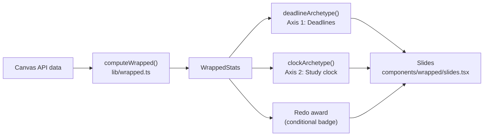
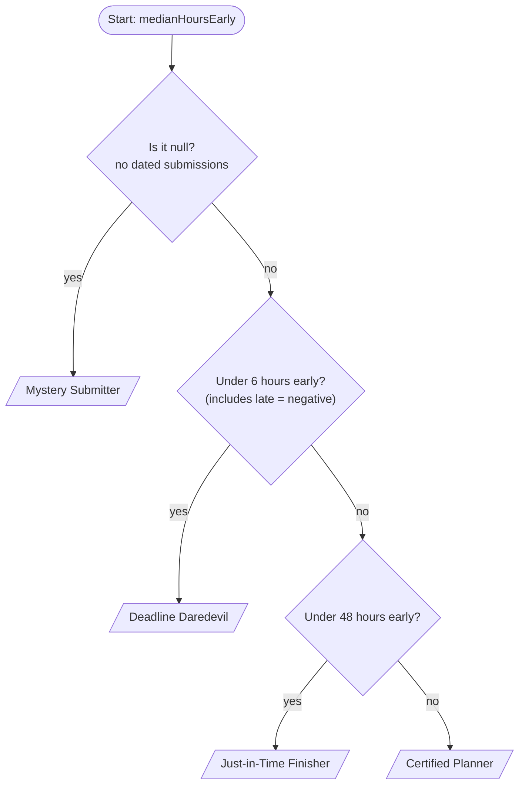
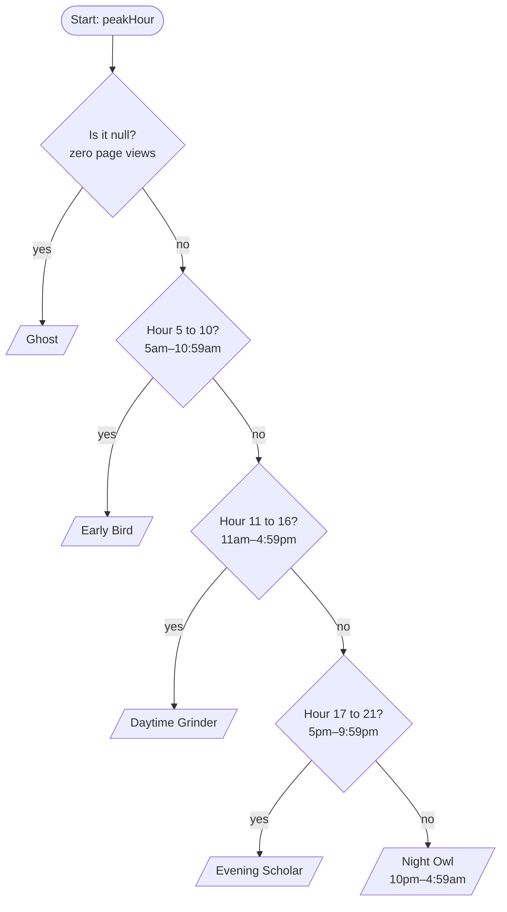
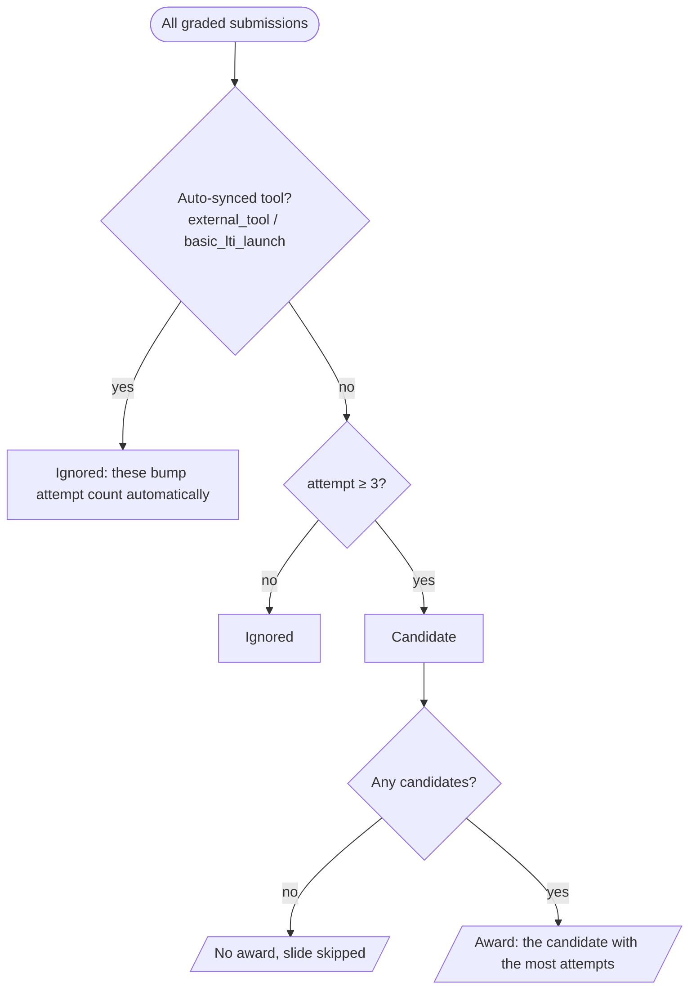

# Canvas Wrapped — Archetype Flowcharts

## Context for the AI assistant reading this

Canvas Wrapped is a browser extension that builds a "Spotify Wrapped"-style recap of a
student's semester from their Canvas LMS data. Part of the recap assigns the student
**archetypes**: short, fun labels (like "Night Owl") based on their habits.

This file documents **every path to every archetype that exists today**, so the team can
customize them: rename them, change thresholds, add new archetypes, or add new axes.

When you suggest changes:

- Only use data listed in **Available data** below. Anything else would need a new
  Canvas API call and is out of scope unless we ask.
- Keep the output format: each archetype function takes numbers from `WrappedStats` and
  returns a stable **id** (e.g. `'night-owl'`). It must handle `null` (missing data) explicitly.
  Display labels and personality lines live in a separate record keyed by id (see code below),
  so renaming a label never breaks the slide art and colors, which are keyed by id.
- Every branch must be reachable and together they must cover every input (no gaps, no overlaps).
- Return (1) an updated Mermaid flowchart, (2) an updated rules table, and (3) the TypeScript
  function, in the same style as the code excerpts below.
- Labels are shown in large type on a slide, so keep them to about 1–3 words.

---

## Overview: where archetypes come from



There are currently **two archetype axes** (each student gets exactly one label per axis)
plus **one conditional award**. The axes are independent, so there are 4 × 5 = 20 possible
combinations. The combinations don't get their own label yet (see ideas at the end).

Rules, labels and lines all live in `lib/archetypes.ts`.

**Archetypes are computed per time range.** The Wrapped has Week / Month / Semester / All-time
views, and each view recomputes the stats from only that range's data, so a student can be a
Night Owl this week and a Daytime Grinder over the semester. Copy that refers to time should
use the range (the slides say "this week", "this semester", ...).

---

## Axis 1: Deadline personality

**Input:** `deadlines.medianHoursEarly`. This is the median, across all graded submissions,
of *hours between submitting and the due date*.

- Positive = submitted before the deadline. Negative = submitted late.
- Only includes submissions that have both a submit time and a due date, and aren't excused.
- `null` when no submission qualifies.



| Archetype (id) | Rule | Plain English |
|---|---|---|
| Mystery Submitter (`mystery`) | `median === null` | We couldn't find any submissions with due dates |
| Deadline Daredevil (`daredevil`) | `median < 6` | Usually submits in the last 6 hours, or late |
| Just-in-Time Finisher (`just-in-time`) | `6 ≤ median < 48` | Usually submits within the last 2 days |
| Certified Planner (`planner`) | `median ≥ 48` | Usually submits 2+ days early |

**Current code:**

```ts
export type DeadlineArchetype = 'mystery' | 'daredevil' | 'just-in-time' | 'planner';

export function deadlineArchetype(medianHoursEarly: number | null): DeadlineArchetype {
  if (medianHoursEarly === null) return 'mystery';
  if (medianHoursEarly < 6) return 'daredevil';
  if (medianHoursEarly < 48) return 'just-in-time';
  return 'planner';
}

// Label + personality lines (one line is picked per student and shown on the slide)
export const DEADLINE_ARCHETYPES: Record<DeadlineArchetype, { label: string; lines: string[] }> = {
  daredevil: {
    label: 'Deadline Daredevil',
    lines: ['Pressure makes diamonds, and you are very, very shiny.', /* ... */],
  },
  // ...one entry per id
};
```

**Caveats for tuning:**

- zyBooks-style auto-synced assignments update their submit time on every activity, which
  can pull the median around.
- Only *graded* work is counted, so assignments that are submitted but not yet graded are missing.

---

## Axis 2: Study clock

**Input:** `clock.peakHour`, the hour of day (0–23, in the student's Canvas timezone) with
the most Canvas page views, summed across all current courses.

- Source: Canvas's per-course analytics, bucketed hourly.
- Ties go to the earliest hour.
- `null` when there are zero page views. This happens when analytics are unavailable,
  for example if all courses are from a past, locked term.



| Archetype (id) | Rule | Time window |
|---|---|---|
| Ghost (`ghost`) | `peakHour === null` | No activity data |
| Early Bird (`early-bird`) | `5 ≤ h < 11` | 5:00am – 10:59am |
| Daytime Grinder (`daytime`) | `11 ≤ h < 17` | 11:00am – 4:59pm |
| Evening Scholar (`evening`) | `17 ≤ h < 22` | 5:00pm – 9:59pm |
| Night Owl (`night-owl`) | otherwise (`h ≥ 22` or `h < 5`) | 10:00pm – 4:59am |

**Current code:**

```ts
export type ClockArchetype = 'ghost' | 'early-bird' | 'daytime' | 'evening' | 'night-owl';

export function clockArchetype(peakHour: number | null): ClockArchetype {
  if (peakHour === null) return 'ghost';
  if (peakHour >= 5 && peakHour < 11) return 'early-bird';
  if (peakHour >= 11 && peakHour < 17) return 'daytime';
  if (peakHour >= 17 && peakHour < 22) return 'evening';
  return 'night-owl';
}
// Labels and lines: CLOCK_ARCHETYPES, same shape as DEADLINE_ARCHETYPES.
```

Each clock archetype also has its own slide color and illustration (e.g. Night Owl = moon and
twinkling stars on a night gradient, Early Bird = sunrise), keyed by id in `components/wrapped/art.tsx`.

**Caveats for tuning:**

- The peak is a single hour, so a student with two similar peaks (e.g. 1pm and 11pm)
  gets whichever is slightly bigger. `clock.byHour` has the full distribution if you want a
  smarter rule (e.g. share of views after 10pm).
- The "Ghost" label never gets its own slide, because the Study clock slide is hidden when
  there are zero page views. It still appears on the final Recap slide.

---

## Conditional award: "Never give up"

Not an axis. Either the student earns it or the slide is skipped.



Constants: `MIN_REDO_ATTEMPTS = 3`, `AUTO_SYNC_TYPES = {'external_tool', 'basic_lti_launch'}`.

---

## Where each archetype appears

| Slide | Shown when | Uses |
|---|---|---|
| Deadline personality | the range has submissions with due dates | Axis 1 label, median hours, closest call, most prepared |
| Study clock | `clock.totalPageViews > 0` | Axis 2 label, peak hour, peak day, hourly chart |
| Never give up | a redo award exists | award assignment, course, attempts |
| Recap (last slide) | always | Axis 1 and Axis 2 labels in a grid |

---

## Available data (`WrappedStats`)

These are the only fields archetype rules can use without new API work. Every number is
already computed in `lib/wrapped.ts`.

```ts
interface WrappedStats {
  studentName: string;
  terms: string[];                     // e.g. ["Summer 2026", "Fall 2026"]
  dateRange: { from: string; to: string } | null;
  courses: {                           // sorted by hours, most first
    id: number; label: string;
    hours: number;                     // Canvas-measured time in course
    score: number | null;              // current grade %, can exceed 100
    grade: string | null;              // letter grade, if the course uses one
    submissions: number;               // graded submissions in this course
    pageViews: number;                 // current-term courses only
  }[];
  totalHours: number;
  submissions: {
    total: number;
    byType: { label: string; count: number }[];  // Quizzes, Discussion posts, File uploads…
    late: number;
    onTimeRate: number;                // 0–1
    perfectScores: number;             // count of 100%+ scores
    avgPercent: number | null;         // average score %
    lateNight: number;                 // submissions between midnight and 5am
    busiestDay: string | null;         // weekday with the most submissions
  };
  deadlines: {
    medianHoursEarly: number | null;
    closestCall: { assignment: string; course: string; minutesBefore: number } | null;
    earliest: { assignment: string; course: string; daysBefore: number } | null;
    archetype: DeadlineArchetype;      // Axis 1 id
  };
  redo: { assignment: string; course: string; attempts: number } | null;
  clock: {
    totalPageViews: number;
    peakHour: number | null;           // 0–23
    peakDay: string | null;            // "Monday"…
    archetype: ClockArchetype;         // Axis 2 id
    byHour: number[];                  // 24 page-view totals
    byDay: number[];                   // 7 totals, index 0 = Sunday
  };
  messages: { threads: number; received: number; sent: number };
}
```

**Typical ranges** (one real student over about 3.5 months, for calibration only):
`totalHours` ≈ 50, `submissions.total` ≈ 140, `onTimeRate` ≈ 0.97,
`medianHoursEarly` ≈ 14, `lateNight` ≈ 1, `totalPageViews` ≈ 2,700 across 3 courses.

---

## Ideas we're considering (not built yet)

- **Combo titles:** a unique name for each of the 20 Axis 1 × Axis 2 pairs
  (e.g. Deadline Daredevil + Night Owl → "Midnight Speedrunner").
- **Axis 3, workload style:** from `submissions.byType` (e.g. mostly discussion posts →
  "The Conversationalist", mostly quizzes → "Quiz Machine").
- **Axis 4, consistency:** from `byDay` spread (activity spread evenly across the week vs.
  concentrated on one or two days).
- **Grade-based flair:** from `perfectScores` / `avgPercent`, used carefully so no one feels
  bad. Labels should always be positive or playful, never shaming.

## Files to edit

- `lib/archetypes.ts`: archetype rules, labels, and personality lines (start here)
- `lib/wrapped.ts`: the stats themselves, plus `MIN_REDO_ATTEMPTS` and `AUTO_SYNC_TYPES`
- `lib/wrapped-copy.ts`: which slides show, and the personality line on every other slide
- `components/wrapped/art.tsx`: per-archetype colors (`DEADLINE_THEME`, `CLOCK_THEME`) and illustrations
- `components/wrapped/slides.tsx`: slide layouts
- Check changes with `node scripts/wrapped-demo.ts --range=week|month|semester|all`
